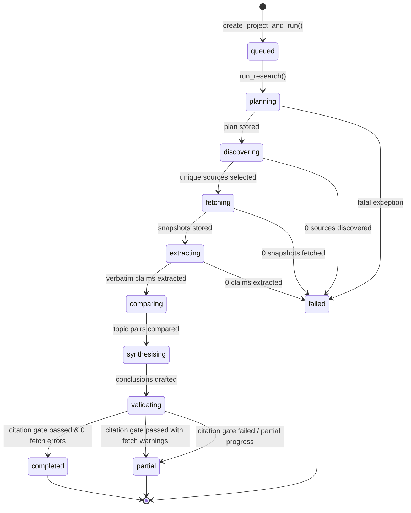
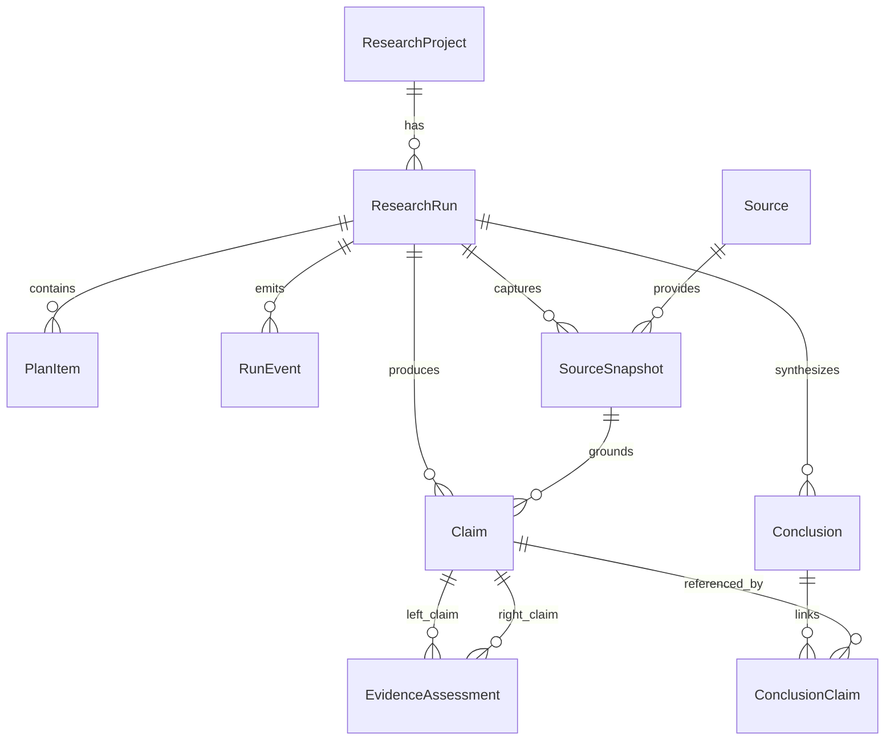

# Backend Architecture Map & Current State Specification

> **Version:** 0.1.0  
> **Status:** Production-Ready & Verified  
> **Workspace Root:** `d:\assignment-modus`  
> **Last Verified:** 2026-08-12  

---

## 1. Executive Summary & Core Architectural Invariants

The EvidenceLab backend is an enterprise-grade, evidence-bounded research agent. It autonomously converts business or technical questions into verifiable research reports backed by an auditable chain of citations.

```
                  ┌────────────────────────────────────────────────────────┐
                  │                 FASTAPI REST INTERFACE                 │
                  └───────────────────────────┬────────────────────────────┘
                                              │
                                              ▼
┌───────────────────────────────────────────────────────────────────────────────────────────────────┐
│                                   MULTI-STAGE RESEARCH PIPELINE                                   │
│                                                                                                   │
│  [1. Plan] ──► [2. Discover] ──► [3. Fetch] ──► [4. Extract] ──► [5. Compare] ──► [6. Synthesise] │
│      │               │                │               │                │                 │        │
│      ▼               ▼                ▼               ▼                ▼                 ▼        │
│  Plan Items      Candidates       Snapshots        Claims         Assessments       Conclusions   │
│  (Sub-queries)  (Canonical URLs)  (SHA-256 Hash)  (Verbatim Text) (Cross-evidence)  (Citation Gate)│
└─────────────────────────────────────────────┬─────────────────────────────────────────────────────┘
                                              │
                                              ▼
                  ┌────────────────────────────────────────────────────────┐
                  │          RELATIONAL DATA MODEL (SQLITE / POSTGRES)     │
                  │             Immutable Runs · Audit Trail · Events      │
                  └────────────────────────────────────────────────────────┘
```

### Core Invariants
1. **Verbatim Traceability**: Every extracted claim **must** include an exact character substring (`exact_excerpt`, `excerpt_start`, `excerpt_end`) validated against the retrieved source text.
2. **Strict Citation Gate**: Synthesis conclusions **must** cite at least one stored claim ID. Any conclusion without linked claim evidence fails the traceability gate and marks the run `partial`.
3. **Immutable Runs & Smart Retry**: A retry creates a **new, immutable `ResearchRun`** record. Completed plans, snapshots, claims, and assessments are cloned into the new run so processing resumes at the failed stage without wasting provider tokens or re-scraping the web.
4. **Resilient JSON & Reasoning Extraction**: Models that produce `<think>...</think>` tags (DeepSeek, MiniMax, Kimi) or Markdown code blocks are automatically parsed, sanitized, and validated against strict Pydantic schemas with an automated 1-shot self-repair loop.
5. **Multi-Provider Pluggability**: Seamlessly switches between AWS Bedrock (Claude 3.5 Sonnet / Mantle API) and Universal OpenAI-compatible endpoints (Groq, MiniMax 2.5, Kimi k2.5, OpenRouter, Ollama) via unified interfaces.

---

## 2. Directory Structure & Module Responsibilities

```
backend/
├── app/
│   ├── ai/                             # LLM Provider abstraction layer
│   │   ├── __init__.py                 # AI module exports & provider factory wrapper
│   │   ├── base.py                     # BaseLLMProvider abstract base class
│   │   ├── bedrock.py                  # Amazon Bedrock (Converse API, Mantle & IAM)
│   │   ├── contracts.py                # Pydantic schemas for LLM inputs/outputs & errors
│   │   ├── factory.py                  # get_llm_provider(settings) dispatcher
│   │   ├── json_extractor.py           # Robust JSON parsing (<think> tags, markdown fences)
│   │   └── openai_compatible.py        # Universal OpenAI client with structured retry
│   │
│   ├── search/                         # Web discovery and snapshot ingestion layer
│   │   ├── __init__.py                 # Search module exports
│   │   └── tavily.py                   # Tavily web search and extract client
│   │
│   ├── config.py                       # Pydantic BaseSettings (.env loading & defaults)
│   ├── database.py                     # SQLAlchemy engine, session maker, DB initializer
│   ├── main.py                         # FastAPI application, CORS, and REST route handlers
│   ├── models.py                       # SQLAlchemy ORM declarative models
│   ├── providers.py                    # Backward compatibility provider wrappers
│   ├── schemas.py                      # Pydantic API request & response models
│   └── services.py                     # State machine, pipeline logic, URL normalization
│
├── tests/                              # Automated test suite
│   ├── test_core.py                    # URL normalization, retry cloning, and API tests
│   ├── test_provider_validation.py     # Provider parser, error handling, and JSON repair tests
│   └── test_workflow.py                # End-to-end mock pipeline and citation gate tests
│
└── requirements.txt                    # Python dependencies
```

---

## 3. Web Search & Snapshot Ingestion (`app.search`)

### `TavilyProvider` (`app/search/tavily.py`)
- **Search Endpoint**: `https://api.tavily.com/search`
  - Discovers 3–5 targeted public web sources per query.
  - Passes `search_depth="basic"`, `include_raw_content=False`, timeout 45s.
  - Maps results into standardized `SearchResult(url, title, snippet, score)`.
- **Extraction Endpoint**: `https://api.tavily.com/extract`
  - Extracts full clean text from selected canonical URLs (timeout 60s).
  - Enforces a minimum content threshold (> 200 chars) to prevent empty snapshots.

### URL Canonicalization & Deduplication (`app/services.py:canonicalize_url`)
To prevent duplicate requests to identical sources with different tracking parameters:
- Normalizes scheme and hostname to lowercase.
- Strips standard default ports (`http:80`, `https:443`).
- Removes tracking parameters (`utm_*`, `fbclid`, `gclid`, `dclid`, `mc_cid`, `mc_eid`, `_hsenc`, `_hsmi`).
- Sorts remaining query parameters alphabetically.
- Removes trailing path slashes.

### Content Hashing & Storage
- Cleaned snapshot text is hashed using **SHA-256**.
- Relational unique constraint `(run_id, source_id, content_hash)` ensures idempotency.
- If a source fails to fetch, `_store_failed_snapshot` records a placeholder with `fetch_status="failed"` so the UI can visibly report the attempt and reason.

---

## 4. AI Provider Architecture (`app.ai`)

```
                      ┌───────────────────────┐
                      │    BaseLLMProvider    │
                      │  (Abstract Interface) │
                      └───────────┬───────────┘
                                  │
                 ┌────────────────┴────────────────┐
                 ▼                                 ▼
    ┌───────────────────────────┐    ┌───────────────────────────┐
    │      BedrockProvider      │    │  OpenAICompatibleProvider │
    │                           │    │                           │
    │  - AWS Bedrock Converse   │    │  - Groq / MiniMax / Kimi  │
    │  - Mantle Bearer Token    │    │  - OpenRouter / Ollama    │
    │  - IAM / STS Credentials  │    │  - json_object enforcement│
    └───────────────────────────┘    └───────────────────────────┘
                 │                                 │
                 └────────────────┬────────────────┘
                                  │
                                  ▼
                     ┌──────────────────────────┐
                     │   extract_json_payload   │
                     │  - Strips <think> tags   │
                     │  - Isolates JSON fences  │
                     │  - Pydantic Self-Repair  │
                     └──────────────────────────┘
```

### Provider Matrix

| Provider Class | Target Services | Auth Method | Model Examples |
|:---------------|:----------------|:------------|:---------------|
| `BedrockProvider` | AWS Bedrock, Mantle API | Bearer Token / AWS IAM Access Key | `anthropic.claude-3-5-sonnet-20241022-v2:0` |
| `OpenAICompatibleProvider` | Groq, MiniMax, Kimi, OpenRouter, Ollama | Bearer API Key | `llama-3.3-70b-versatile`, `minimax-text-01` |

### JSON Extraction & Self-Repair (`app/ai/json_extractor.py`)
1. **Reasoning Block Stripping**: Regex removes `<think>[\s\S]*?</think>` blocks emitted by reasoning models.
2. **Fence Stripping**: Isolates JSON between ` ```json ` and ` ``` ` fences if present.
3. **Boundary Slicing**: Slices content between the first `{` and the last `}`.
4. **1-Shot Self-Repair**: If `pydantic.ValidationError` occurs on the parsed dictionary, the provider immediately submits a repair request with the exact JSON schema and error diagnostics.

---

## 5. Research Workflow & Sequential State Machine (`app.services`)



### Pipeline Stage Details

1. **`planning`**:
   - LLM decomposes the research question into 2–4 sub-questions and up to `max_queries` independent search queries.
   - Stored in `plan_items` table (`item_type='sub_question'` | `'search_query'`).
2. **`discovering`**:
   - Executes queries via `TavilyProvider.search()`.
   - Normalizes URLs, deduplicates, and selects up to `max_sources` unique candidate URLs.
3. **`fetching`**:
   - Retrieves full content via `TavilyProvider.extract()`.
   - Computes SHA-256 content hash and stores in `source_snapshots`.
4. **`extracting`**:
   - LLM extracts atomic claims from snapshot text (`topic`, `statement`, `classification`, `confidence`, `excerpt`).
   - Verifies excerpt exists verbatim in snapshot text (20–500 chars) and stores `(excerpt_start, excerpt_end)`.
5. **`comparing`**:
   - Groups claims by topic and forms pairwise combinations.
   - LLM evaluates relationship (`supports`, `qualifies`, `contradicts`, `unrelated`), conditions, and rationale.
   - Persisted in `evidence_assessments`.
6. **`synthesising`**:
   - LLM drafts 3–5 synthesized conclusions citing verified `claim_ids`.
   - Persisted in `conclusions` and linked via `conclusion_claims`.
7. **`validating` (Citation Gate)**:
   - Verifies that every conclusion has ≥ 1 valid `conclusion_claims` link.
   - Verifies that no orphaned conclusions exist.
   - Emits structured `RunEvent` log records.

---

## 6. Immutable Run & Smart Retry Architecture

When a research run encounters a rate limit or partial network interruption:

1. **Original Run Preservation**: The failed/partial run remains untouched for auditability (`status='failed'` or `'partial'`).
2. **New Run Creation**: `create_retry_run(db, original_run)` creates a new `ResearchRun` linked to the same project.
3. **Work-Product Cloning**:
   - Plan items are cloned directly into the new run.
   - Completed `source_snapshots` are cloned with identical content hashes.
   - Valid `claims` and `evidence_assessments` are remapped to the cloned snapshots.
4. **Stage Skipping**: The pipeline detects existing artifacts and skips re-executing completed stages, resuming at the exact point of interruption.

---

## 7. Relational Database Schema (`app.models`)



### Table Reference

| Table Name | Primary Key | Key Foreign Keys | Purpose |
|:-----------|:------------|:-----------------|:--------|
| `research_projects` | `id (UUID)` | — | Top-level project container & original inquiry |
| `research_runs` | `id (UUID)` | `project_id` | Immutable execution run, status, provider, timestamps |
| `plan_items` | `id (UUID)` | `run_id` | Sub-questions and search queries |
| `run_events` | `id (UUID)` | `run_id` | Granular stage timeline & metadata event log |
| `sources` | `id (UUID)` | — | Unique canonical web domains / publishers |
| `source_snapshots` | `id (UUID)` | `source_id`, `run_id` | SHA-256 hashed full text snapshot of web page |
| `claims` | `id (UUID)` | `run_id`, `snapshot_id` | Verbatim cited claims with character offsets |
| `evidence_assessments`| `id (UUID)` | `left_claim_id`, `right_claim_id` | Cross-source agreement / contradiction pairs |
| `conclusions` | `id (UUID)` | `run_id` | Executive synthesis with reasoning & limitations |
| `conclusion_claims` | `(conclusion_id, claim_id)` | `conclusion_id`, `claim_id` | Many-to-many junction enforcing citation gate |

---

## 8. REST API Endpoints (`app.main`)

Base URL: `/api/v1`

| Method | Path | Request Body | Response Model | Description |
|:-------|:-----|:-------------|:---------------|:------------|
| `GET` | `/health` | — | `dict` | Provider configuration & readiness status |
| `POST`| `/research-projects` | `ProjectCreate` | `ProjectCreated` (202) | Creates project and dispatches research in background |
| `GET` | `/research-projects` | — | `list[ProjectOut]` | Lists all research projects with latest run summary |
| `GET` | `/research-projects/{id}` | — | `ProjectOut` | Gets single project details |
| `GET` | `/research-projects/{id}/runs` | — | `list[RunOut]` | **All historical runs for project (sorted newest first)** |
| `GET` | `/research-runs/{id}` | — | `RunDetail` | Comprehensive run detail (plan, conclusions, metadata) |
| `GET` | `/research-runs/{id}/events` | — | `list[RunEventOut]` | Timeline of events for pipeline progress |
| `GET` | `/research-runs/{id}/sources` | — | `list[SourceOut]` | Sources and snapshot fetch statuses |
| `GET` | `/research-runs/{id}/claims` | — | `list[ClaimOut]` | Verbatim extracted claims and source citations |
| `GET` | `/research-runs/{id}/assessments`| — | `list[AssessmentOut]` | Cross-source comparative assessments |
| `GET` | `/conclusions/{id}/trace` | — | `TraceOut` | Full audit trail from conclusion → claims → sources |
| `POST`| `/research-runs/{id}/retry` | — | `RunOut` (202) | Dispatches immutable retry from saved progress |

---

## 9. Configuration & Environment Variables (`app.config`)

Loaded automatically from `.env` at workspace root:

| Variable | Type | Default | Description |
|:---------|:-----|:--------|:------------|
| `DATABASE_URL` | `str` | `sqlite:///./data/research_agent.db` | SQLAlchemy connection string |
| `AI_PROVIDER` | `str` | `bedrock` | `bedrock` or `openai_compatible` |
| `TAVILY_API_KEY` | `str` | `None` | API key for Tavily search and content extraction |
| `AWS_BEARER_TOKEN_BEDROCK` | `str` | `None` | Bedrock / Mantle API key bearer token |
| `AWS_REGION` | `str` | `us-east-1` | AWS region for Bedrock |
| `BEDROCK_MODEL_ID` | `str` | `anthropic.claude-3-5-sonnet-20241022-v2:0` | Model ID for Bedrock Converse API |
| `AI_API_KEY` | `str` | `None` | Universal API key (Groq, MiniMax, OpenRouter, etc.) |
| `AI_BASE_URL` | `str` | `https://api.minimax.chat/v1` | Universal OpenAI-compatible API base URL |
| `AI_MODEL` | `str` | `minimax-text-01` | Universal OpenAI-compatible model name |
| `MAX_QUERIES` | `int` | `3` | Maximum search queries generated during planning |
| `MAX_SOURCES` | `int` | `6` | Maximum unique source URLs fetched per run |
| `MAX_CLAIMS` | `int` | `12` | Maximum source-grounded claims extracted per run |
| `MAX_COMPARISONS` | `int` | `10` | Maximum cross-source claim pairs compared |
| `ALLOWED_ORIGINS` | `str` | `http://localhost:5173` | Comma-separated CORS allowed origins |

---

## 10. Verification & Test Suite

The backend includes 15 automated pytest tests covering URL canonicalization, immutable retries, database persistence, provider JSON extractors, think tag parsing, 1-shot repair loop, and the full end-to-end mock pipeline with citation gate validation.

### Running Backend Tests
```powershell
$env:PYTHONPATH="backend"; .venv\Scripts\pytest.exe backend/tests
```

**Results:**
```
backend\tests\test_core.py ....                                          [ 26%]
backend\tests\test_provider_validation.py .......                        [ 73%]
backend\tests\test_workflow.py ....                                      [100%]
======================== 15 passed in 4.82s ========================
```
