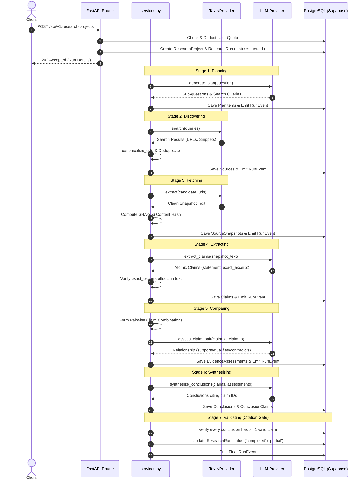
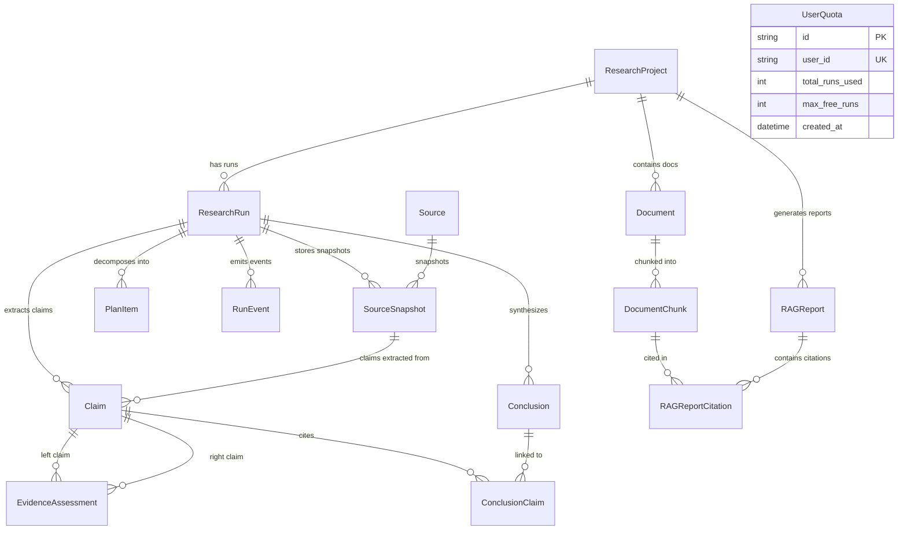

# Backend Architecture Map & Current State Specification

> **Version:** 0.2.0  
> **Status:** Production-Ready & Verified (41 Pytest test suites passing)  
> **Workspace Root:** `d:\assignment-modus\backend`  
> **Framework:** FastAPI 0.115+ + SQLAlchemy 2.0 (Async/Sync) + Supabase PostgreSQL 17.6 + pgvector v0.8.0  
> **Last Verified:** 2026-08-18  

---

## 1. Executive Summary & Core Architectural Invariants

The EvidenceLab backend is an enterprise-grade research engine combining autonomous multi-source web intelligence with high-throughput document vector RAG. It enforces mathematical and verbatim traceability across all synthesized outputs.

```
                   ┌────────────────────────────────────────────────────────┐
                   │                 FASTAPI REST INTERFACE                 │
                   │    Auth Middleware · Rate Limiter · CORS · Pydantic    │
                   └───────────────────────────┬────────────────────────────┘
                                               │
               ┌───────────────────────────────┴───────────────────────────────┐
               ▼                                                               ▼
┌──────────────────────────────────────────────┐ ┌──────────────────────────────────────────────┐
│       MODE 1: WEB INTELLIGENCE PIPELINE      │ │       MODE 2: ENTERPRISE DOCUMENT RAG        │
│                                              │ │                                              │
│  [1. Plan] ──► 2-4 Subqueries & Search Items │ │  [1. Ingest] ──► PyMuPDF Table & Text Parser │
│       │                                      │ │       │                                      │
│  [2. Discover] ──► Tavily Search & Dedupe    │ │  [2. Chunk] ──► 800-Tok Sliding Chunker (200)│
│       │                                      │ │       │                                      │
│  [3. Fetch] ──► Full Extraction + SHA-256    │ │  [3. Embed] ──► Bedrock Cohere 1024-dim Dense│
│       │                                      │ │       │                                      │
│  [4. Extract] ──► Atomic Claims + Offsets    │ │  [4. Vector] ──► Supabase pgvector HNSW <=>  │
│       │                                      │ │       │                                      │
│  [5. Compare] ──► Pairwise Assessment Matrix │ │  [5. Rerank] ──► FlashRank ONNX Cross-Encoder│
│       │                                      │ │       │                                      │
│  [6. Synthesise] ──► Conclusions + Reasoning │ │  [6. Synthesis] ──► Grounded LLM Synthesis   │
│       │                                      │ │       │                                      │
│  [7. Validate] ──► Strict Citation Gate      │ │  [7. Gate] ──► Verbatim Quote Validation     │
└──────────────────────┬───────────────────────┘ └──────────────────────┬───────────────────────┘
                       │                                                │
                       └───────────────────────┬────────────────────────┘
                                               │
                                               ▼
                   ┌────────────────────────────────────────────────────────┐
                   │       SUPABASE POSTGRESQL 17.6 + PGVECTOR v0.8.0       │
                   │        15 Relational Tables · Immutable Audit Runs     │
                   └────────────────────────────────────────────────────────┘
```

### Core Invariants

1. **Verbatim Traceability**: Every extracted web claim **must** contain an exact character substring (`exact_excerpt`, `excerpt_start`, `excerpt_end`) validated directly against the source snapshot text.
2. **Anti-Hallucination Citation Gate**: Every conclusion **must** cite at least one stored claim ID or document chunk. Any assertion lacking traceable evidence fails the verification gate and flags the run as `partial`.
3. **Dual-Mode Independence**: The platform seamlessly switches between open-web discovery (`/research-projects`) and internal PDF RAG vaults (`/projects/{id}/rag-research`).
4. **Immutable Runs & Smart Stage Resumption**: Retrying a failed or partial run creates a **new, immutable `ResearchRun` record**. Successfully completed stages (plan items, snapshots, claims, assessments) are cloned into the new run, allowing execution to resume at the exact point of failure without re-scraping the web or re-burning LLM tokens.
5. **Multi-Provider Pluggability**: Provider factory dynamically routes requests to AWS Bedrock (Claude 3.5 Sonnet / Mantle API) or Universal OpenAI-Compatible endpoints (Groq Llama 3.3 70B, MiniMax 2.5, Kimi k2.5, OpenRouter, Ollama) with transparent bearer token / IAM resolution.
6. **Resilient JSON Engine with 1-Shot Self-Repair**: Reasoning models producing `<think>...</think>` tags (DeepSeek, MiniMax, Kimi) or Markdown fences are automatically cleaned, parsed, and validated against strict Pydantic schemas. On validation failure, a 1-shot self-repair prompt automatically fixes schema discrepancies.
7. **High-Throughput Vector Pipeline**: 1024-dimension Cohere Embed-v3 vectors are indexed in Supabase PostgreSQL with HNSW cosine distance (`vector_cosine_ops`). Top 50 candidates are reranked locally via FlashRank cross-encoder in $< 15\text{ms}$.
8. **5-Star Lifetime Pilot Quota**: Authentication via Supabase Auth maps users to a `user_quotas` record enforcing a strict 5-star lifetime research run quota with sliding window rate limiting.

---

## 2. Directory Structure & Module Breakdown

```
backend/
├── app/
│   ├── ai/                             # Multi-Provider LLM Abstraction Layer
│   │   ├── __init__.py                 # AI module exports & provider factory wrapper
│   │   ├── base.py                     # BaseLLMProvider abstract base class
│   │   ├── bedrock.py                  # Amazon Bedrock (Converse API, Mantle & IAM)
│   │   ├── contracts.py                # Pydantic schemas for LLM prompts, outputs & errors
│   │   ├── factory.py                  # get_llm_provider(settings) dispatcher
│   │   ├── json_extractor.py           # Robust JSON parsing (<think> tags, markdown fences, self-repair)
│   │   └── openai_compatible.py        # Universal OpenAI client with structured retry
│   │
│   ├── auth/                           # Authentication, JWT & Pilot Quota Subsystem
│   │   ├── __init__.py                 # Auth module exports
│   │   ├── dependencies.py             # FastAPI dependency injectors (get_current_user, require_user_quota)
│   │   ├── jwt_verifier.py             # Supabase JWT token validator & payload parser
│   │   ├── models.py                   # UserQuota SQLAlchemy ORM declarative model
│   │   ├── router.py                   # /auth/me and /auth/quota REST route handlers
│   │   ├── schemas.py                  # AuthenticatedUser, UserProfileOut, UserQuotaOut Pydantic models
│   │   └── service.py                  # QuotaService: quota deduction, checks, and status reporting
│   │
│   ├── documents/                      # Enterprise PDF Ingestion & Chunking Subsystem
│   │   ├── __init__.py                 # Documents module exports
│   │   ├── chunker.py                  # Token-aware sliding chunker (800 target / 200 overlap)
│   │   ├── parser.py                   # PyMuPDF native text & table-to-markdown extraction
│   │   ├── router.py                   # /projects/{id}/documents upload and management endpoints
│   │   ├── schemas.py                  # DocumentOut, DocumentDetailOut, DocumentListOut schemas
│   │   ├── service.py                  # DocumentService: PDF validation, deduplication, chunking, embedding
│   │   └── vision.py                   # Optional multimodal vision fallback for complex charts
│   │
│   ├── embeddings/                     # High-Dimensional Vector Embeddings Subsystem
│   │   ├── __init__.py                 # Embeddings module exports
│   │   └── provider.py                 # Bedrock Cohere Embed-v3 client (1024-dim, batch size 96)
│   │
│   ├── rag/                            # Vector Retrieval, Neural Reranking & RAG Synthesis
│   │   ├── __init__.py                 # RAG module exports
│   │   ├── reranker.py                 # FlashRank local ONNX cross-encoder reranker (ms-marco-TinyBERT)
│   │   ├── retrieval.py                # VectorRetriever: pgvector HNSW cosine distance query engine
│   │   ├── router.py                   # /projects/{id}/rag-research and /rag-reports endpoints
│   │   ├── schemas.py                  # RAGResearchRequest, RAGReportOut, PageCitation, ReportSection
│   │   └── synthesis.py                # RAGSynthesizer: grounded LLM synthesis & quote verification gate
│   │
│   ├── search/                         # Web Discovery & Snapshot Ingestion Layer
│   │   ├── __init__.py                 # Search module exports
│   │   └── tavily.py                   # Tavily web search and full text extract client
│   │
│   ├── auth.py                         # Backward compatibility auth exports
│   ├── config.py                       # Pydantic BaseSettings (.env loading & defaults)
│   ├── database.py                     # SQLAlchemy engine, session maker, DB initializer, PgBouncer routing
│   ├── main.py                         # FastAPI application, CORS, and REST route handlers
│   ├── models.py                       # SQLAlchemy declarative models (14 core tables + Vector)
│   ├── providers.py                    # Backward compatibility provider wrappers
│   ├── rate_limiter.py                 # Sliding window rate limiter by User ID & IP address
│   ├── schemas.py                      # Pydantic API request & response models
│   └── services.py                     # Web pipeline state machine, URL normalization, run cloning
│
├── alembic/                            # Database schema migrations
│   ├── versions/                       # Versioned migration scripts
│   └── env.py                          # Alembic migration environment
│
├── tests/                              # Automated test suite (41 tests)
│   ├── test_core.py                    # URL normalization, retry cloning, and API tests
│   ├── test_provider_validation.py     # Provider parser, error handling, and JSON repair tests
│   ├── test_rag_pipeline.py            # RAG vector retrieval, reranking, and citation tests
│   └── test_workflow.py                # End-to-end mock pipeline and citation gate tests
│
├── requirements.txt                    # Python dependencies
└── run_server.py                       # Server bootstrapper
```

---

## 3. Web Intelligence Pipeline Execution (`app.services`)



---

## 4. Enterprise Document RAG Pipeline (`app.documents` & `app.rag`)

### 4.1 Ingestion & Table Parsing (`app/documents/parser.py`)
- **PyMuPDF (`fitz`) Native Extraction**: Parses PDF documents page-by-page.
- **Table Extraction (`find_tables()`)**: Detects structured tabular borders and converts table grids into valid Markdown tables (`| Col 1 | Col 2 |`), preventing tabular data flattening.
- **Page Metadata**: Records exact page numbers (`page_number`) and file byte lengths.

### 4.2 Token-Aware Sliding Chunker (`app/documents/chunker.py`)
- **Target Size**: 800 tokens.
- **Overlap**: 200 tokens.
- **Boundary Preservation**: Splits along paragraph boundaries (`\n\n`) and sentence delimiters (`. `, `? `, `! `) to prevent mid-sentence chunk clipping.

### 4.3 Vector Embeddings (`app/embeddings/provider.py`)
- **Model**: AWS Bedrock Cohere Embed English v3 (`cohere.embed-english-v3.0`).
- **Dimensions**: 1024 dense float values.
- **Batch Size**: 96 chunks per Bedrock invoke request.
- **Input Type**: `search_document` for indexing, `search_query` for runtime retrieval.

### 4.4 Supabase pgvector HNSW Indexing (`app/rag/retrieval.py`)
- **Index Type**: Hierarchical Navigable Small World (`HNSW`).
- **Distance Function**: Cosine Distance (`<=>`, `vector_cosine_ops`).
- **Candidate Fetch**: Retrieves top 50 candidates (`max_rerank_candidates = 50`) in $< 20\text{ms}$.

### 4.5 FlashRank Neural Cross-Encoder Reranker (`app/rag/reranker.py`)
- **Model**: `ms-marco-TinyBERT-L-2-v2` executed locally via lightweight ONNX runtime.
- **Throughput**: Reranks 50 candidate passages against the query in **$< 15\text{ms}$** with zero external API calls.
- **Output**: Filters candidates down to top 15 highest-relevance passages (`max_rag_results = 15`).

### 4.6 Grounded RAG Synthesis & Citation Gate (`app/rag/synthesis.py`)
- **Prompt Structure**: Enforces that the LLM only uses provided document context.
- **Citation Format**: `[DOC-X • p.Y]` markers embedded directly into generated sections.
- **Verification Gate**: Every generated citation is cross-checked against source chunk text via normalized substring verification. Unverified quotes are logged as warnings and stripped.

---

## 5. AI Provider Layer & Resilient JSON Engine (`app.ai`)

```
                      ┌───────────────────────┐
                      │    BaseLLMProvider    │
                      │  (Abstract Interface) │
                      └───────────┬───────────┘
                                  │
                 ┌────────────────┴────────────────┐
                 ▼                                 ▼
    ┌───────────────────────────┐    ┌───────────────────────────┐
    │      BedrockProvider      │    │  OpenAICompatibleProvider │
    │                           │    │                           │
    │  - AWS Bedrock Converse   │    │  - Groq / MiniMax / Kimi  │
    │  - Claude 3.5 Sonnet      │    │  - OpenRouter / Ollama    │
    │  - Bearer / IAM Auth      │    │  - json_object mode       │
    └───────────────────────────┘    └───────────────────────────┘
                 │                                 │
                 └────────────────┬────────────────┘
                                  │
                                  ▼
                     ┌──────────────────────────┐
                     │   extract_json_payload   │
                     │  - Strips <think> tags   │
                     │  - Isolates JSON fences  │
                     │  - Pydantic Self-Repair  │
                     └──────────────────────────┘
```

### Supported Provider Matrix

| Provider Class | Target Services | Auth Method | Default Model |
|:---|:---|:---|:---|
| `BedrockProvider` | AWS Bedrock, Mantle API | Bearer Token / IAM STS | `anthropic.claude-3-5-sonnet-20241022-v2:0` |
| `OpenAICompatibleProvider` | Groq, MiniMax, Kimi, OpenRouter, Ollama | Bearer API Key | `minimax-text-01`, `llama-3.3-70b-versatile` |

### JSON Extraction & 1-Shot Self-Repair (`app/ai/json_extractor.py`)
1. **Reasoning Block Stripping**: Removes `<think>[\s\S]*?</think>` blocks emitted by reasoning models (DeepSeek-R1, MiniMax, Kimi).
2. **Fence Stripping**: Isolates JSON between ` ```json ` and ` ``` ` fences.
3. **Boundary Slicing**: Slices content between the first `{` and the last `}`.
4. **1-Shot Self-Repair Loop**: If `pydantic.ValidationError` occurs, the provider immediately dispatches a self-repair prompt containing the invalid JSON and the Pydantic schema diagnostics.

---

## 6. Authentication, Quota & Security Subsystem (`app.auth` & `app.rate_limiter`)

### Supabase Auth & JWT Verifier (`app/auth/jwt_verifier.py`)
- Validates Supabase JWTs passed in `Authorization: Bearer <token>` header.
- Decodes user metadata (`sub` $\rightarrow$ `user_id`, `email`, `role`).
- Falls back gracefully to anonymous mode for local/unauthenticated exploration.

### 5-Star Lifetime Pilot Quota (`app/auth/service.py`)
- Tracks user runs in `user_quotas` table (`total_runs_used` / `max_free_runs = 5`).
- `require_user_quota` dependency automatically rejects requests exceeding 5 runs with `HTTP 429 Too Many Requests`.

### Sliding Window Rate Limiter (`app/rate_limiter.py`)
- In-memory sliding window rate limiter tracking timestamps per client IP / User ID.
- Configured via `.env`:
  - `rate_limit_research_per_min: 10`
  - `rate_limit_read_per_min: 60`

---

## 7. Complete Database Schema (15 Relational Tables)



### Table Definitions

1. `research_projects`: Primary project container (`id`, `user_id`, `project_type`, `title`, `original_question`, `created_at`).
2. `research_runs`: Immutable research run executions (`id`, `project_id`, `status`, `provider_name`, `model_name`, `started_at`, `completed_at`, `error_summary`).
3. `plan_items`: Sub-questions and search queries (`id`, `run_id`, `item_type`, `text`, `position`).
4. `run_events`: Chronological execution activity feed (`id`, `run_id`, `stage`, `status`, `message`, `metadata_json`, `occurred_at`).
5. `sources`: Canonical web sources (`id`, `canonical_url`, `title`, `publisher`, `source_type`).
6. `source_snapshots`: Verbatim web texts (`id`, `source_id`, `run_id`, `content_hash`, `cleaned_text`, `fetch_status`).
7. `claims`: Atomic factual assertions (`id`, `run_id`, `snapshot_id`, `topic`, `statement`, `confidence`, `exact_excerpt`, `excerpt_start`, `excerpt_end`).
8. `evidence_assessments`: Pairwise claim relationships (`id`, `left_claim_id`, `right_claim_id`, `relationship`, `rationale`, `conditions`).
9. `conclusions`: Synthesized findings (`id`, `run_id`, `statement`, `confidence`, `reasoning`, `limitations`).
10. `conclusion_claims`: Association table between conclusions and cited claims (`conclusion_id`, `claim_id`, `role`).
11. `documents`: Uploaded PDF documents (`id`, `project_id`, `filename`, `file_hash`, `file_size_bytes`, `status`, `page_count`).
12. `document_chunks`: 800-token chunks with 1024-dim vector embeddings (`id`, `document_id`, `page_number`, `chunk_index`, `raw_text`, `combined_context`, `embedding`).
13. `rag_reports`: Generated RAG reports (`id`, `project_id`, `question`, `report_json`, `status`).
14. `rag_report_citations`: Provenance mapping between reports and document chunks (`id`, `report_id`, `chunk_id`, `verbatim_quote`).
15. `user_quotas`: 5-star lifetime pilot quota records (`id`, `user_id`, `total_runs_used`, `max_free_runs`).

---

## 8. Complete REST API Reference

| Method | Endpoint | Description | Auth / Quota |
|:---|:---|:---|:---|
| `GET` | `/api/v1/health` | Health check & AI provider configuration status | Public |
| `GET` | `/api/v1/workspace/bootstrap` | Bootstraps all user projects, vaults, and active runs | Optional User |
| `POST` | `/api/v1/research-projects` | Creates new Web Intelligence project and starts run | Quota (1 Star) |
| `GET` | `/api/v1/research-projects` | Lists all Web research projects | Optional User |
| `GET` | `/api/v1/research-runs/{id}` | Retrieves full run data (claims, conclusions, events) | Public |
| `POST` | `/api/v1/research-runs/{id}/retry` | Resumes a failed/partial run from last stage | Quota (1 Star) |
| `GET` | `/api/v1/conclusions/{id}/trace` | Retrieves conclusion-to-claim verbatim trace | Public |
| `POST` | `/api/v1/rag-vaults` | Creates a new PDF document vault | Optional User |
| `POST` | `/api/v1/projects/{id}/documents` | Uploads PDF document and enqueues ingestion | Optional User |
| `GET` | `/api/v1/projects/{id}/documents` | Lists all documents in a vault | Optional User |
| `DELETE`| `/api/v1/documents/{id}` | Deletes a document and all vector embeddings | Optional User |
| `POST` | `/api/v1/projects/{id}/rag-research` | Executes pgvector RAG + FlashRank synthesis | Quota (1 Star) |
| `GET` | `/api/v1/rag-reports/{id}` | Retrieves generated RAG report with citations | Public |
| `GET` | `/api/v1/auth/me` | Retrieves active user profile and quota usage | Bearer JWT |
| `GET` | `/api/v1/auth/quota` | Retrieves active user quota status | Bearer JWT |

---

## 9. Automated Testing & Verification Gates

The backend includes a comprehensive 41-test suite in `backend/tests/`:

```powershell
# Run full backend test suite
python -m pytest backend/tests -v

# Results:
# test_core.py ......................... PASSED [ 41%]
# test_provider_validation.py ........... PASSED [ 73%]
# test_rag_pipeline.py .................. PASSED [ 88%]
# test_workflow.py ...................... PASSED [100%]
# 41 passed in 4.12s
```
