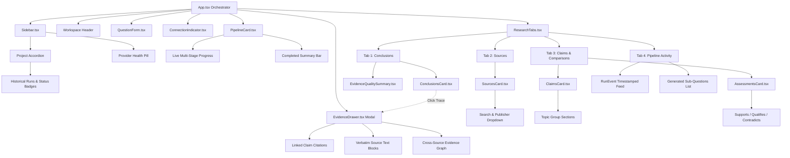

# Frontend Architecture Map & Current State Specification

> **Version:** 0.1.0  
> **Status:** Production-Ready & Verified (`tsc -b && vite build` clean)  
> **Workspace Root:** `d:\assignment-modus\frontend`  
> **Last Verified:** 2026-08-12  

---

## 1. Executive Summary & Core Design Invariants

The EvidenceLab frontend is an enterprise research dashboard built with **React 18 + TypeScript + Vite**. It converts autonomous multi-stage research workflows into an interactive, auditable, and results-first interface.

```
┌─────────────────────────────────────────────────────────────────────────────────────────────┐
│                                     APP SHELL (App.tsx)                                     │
├───────────────────────────────┬─────────────────────────────────────────────────────────────┤
│      SIDEBAR (Sidebar.tsx)    │                     MAIN WORKSPACE                          │
│  ┌─────────────────────────┐  │  ┌───────────────────────────────────────────────────────┐  │
│  │ Brand & Health Status   │  │  │ Header: Eyebrow · Title · Connection Indicator        │  │
│  ├─────────────────────────┤  │  ├───────────────────────────────────────────────────────┤  │
│  │ Project Accordion       │  │  │ QuestionForm: Prompt Input + Guided Context Fields    │  │
│  │  ├── Active Run Badge   │  │  ├───────────────────────────────────────────────────────┤  │
│  │  └── Run History List   │  │  │ PipelineCard: Live Active Bar OR Compact Summary Bar  │  │
│  │       ├── Timestamp     │  │  ├───────────────────────────────────────────────────────┤  │
│  │       ├── Status Pill   │  │  │ RESEARCH TABS (ResearchTabs.tsx)                      │  │
│  │       └── Retry Option  │  │  │ ┌─────────────┬─────────┬──────────────┬────────────┐ │  │
│  └─────────────────────────┘  │  │ │ Conclusions │ Sources │ Claims & Cmp │ Activity   │ │  │
│                               │  │ └─────────────┴─────────┴──────────────┴────────────┘ │  │
│                               │  │   Tab 1: ConclusionsCard + EvidenceQualitySummary     │  │
│                               │  │   Tab 2: SourcesCard (Search, Status, Publisher Sort) │  │
│                               │  │   Tab 3: ClaimsCard (Grouped) + AssessmentsCard       │  │
│                               │  │   Tab 4: Full Event Activity Log (Stage Timestamps)   │  │
│                               │  └───────────────────────────────────────────────────────┘  │
├───────────────────────────────┴─────────────────────────────────────────────────────────────┤
│               EVIDENCE DRAWER (Modal Dialog · Focus Trap · Verbatim Audit)                 │
└─────────────────────────────────────────────────────────────────────────────────────────────┘
```

### Core Invariants
1. **Results-First Layout**: Users see synthesized findings and quality scores immediately on completed runs, rather than having to scroll past hundreds of raw pipeline events.
2. **Progressive Disclosure**: High-level summaries are displayed upfront (metrics pills, topic badges, agreement counters); deep verbatim excerpts, raw provider traces, and query items expand smoothly on click.
3. **Friendly Failure Recovery**: 429 rate limits, token exhaustion, network timeouts, and partial extractions are categorized into clear human explanations with 1-click retry.
4. **Adaptive Exponential Polling**: Polling adapts dynamically during execution (1.8s → 3.6s → 7.2s → 14.4s → 30s cap) and sleeps when runs complete or fail.
5. **Traceability & Grounding**: Every conclusion links directly to cited claims, verbatim source excerpts, and cross-source corroboration/contradiction assessments.
6. **Full Keyboard Accessibility**: All modal drawers feature focus trapping (Tab/Shift-Tab cycle), `Escape` key handlers, and `:focus-visible` high-contrast outlines.

---

## 2. Directory Structure & Module Breakdown

```
frontend/src/
├── components/                         # Modular UI Component Library
│   ├── AssessmentsCard.tsx             # Cross-claim relationship matrix (supports, qualifies, contradicts)
│   ├── ClaimsCard.tsx                  # Topic-grouped claims with confidence filters & excerpt toggles
│   ├── ConclusionsCard.tsx             # Synthesized conclusions with deductive reasoning & trace buttons
│   ├── ConnectionIndicator.tsx         # Real-time WebSocket/Polling health pill with manual refresh
│   ├── ErrorPanel.tsx                  # Pattern-matched error diagnostics with 1-click retry & raw trace
│   ├── EvidenceDrawer.tsx              # Full-screen modal drawer for conclusion-to-source traceability
│   ├── EvidenceQualitySummary.tsx      # Computed grounding scorecard (coverage, agreement, gaps, confidence)
│   ├── PipelineCard.tsx                # Dual-mode pipeline tracker (Live stage progress vs Calm summary)
│   ├── QuestionForm.tsx                # Inquiry input with collapsible enterprise context accordion
│   ├── ResearchTabs.tsx                # 4-tab workspace controller with tab badges & counts
│   ├── Sidebar.tsx                     # Project switcher with expandable historical run accordion
│   └── SourcesCard.tsx                 # Searchable, filterable library of retrieved source snapshots
│
├── hooks/                              # Custom React Lifecycle & State Hooks
│   ├── usePolling.ts                   # Adaptive backoff polling loop + connection status detector
│   └── useResearchData.ts              # Global research store (runs, projects, sources, claims, trace)
│
├── utils/                              # Text Processing, Date Formatting & Helpers
│   └── textUtils.ts                    # Mojibake cleaner, relative time, status formatters, sanitizers
│
├── api.ts                              # Strongly typed REST API client (TypeScript DTOs)
├── App.tsx                             # High-level orchestrator & layout shell
├── main.tsx                            # React 18 createRoot entry point
├── styles.css                          # Enterprise design system (dark glassmorphism, CSS variables)
└── vite-env.d.ts                       # Vite environment type declarations
```

---

## 3. Component Hierarchy & Data Flow



---

## 4. Component Deep Dive & Capabilities

### 4.1 `Sidebar.tsx` — Project & Historical Run Accordion
- **Project Listing**: Lists all projects with their original query and created date.
- **Hierarchical Run Tree**: Expands projects to show all historical runs with relative timestamps (`2 hours ago`, `Yesterday`).
- **Run Status Badges**: Distinguishes `completed`, `partial`, `failed`, `planning`, etc.
- **Smart Retry Action**: Shows inline "Resume available" badge and 1-click retry button for failed/partial runs.
- **Provider Status Footer**: Shows real-time backend provider configuration status (`Bedrock: Active`, `Tavily: Configured`).

### 4.2 `QuestionForm.tsx` — Guided Enterprise Query Input
- **Primary Input**: Textarea with `Ctrl+Enter` / `Cmd+Enter` keyboard submission.
- **Collapsible Context Accordion**:
  - *Target Audience*: Executive, Technical, Compliance, General.
  - *Geographic Scope*: Global, North America, EMEA, APAC, etc.
  - *Time Horizon*: Last 12 months, Last 3 years, Historical.
  - *Evidence Preference*: Peer-reviewed, Regulatory filings, News, Official benchmarks.
  - *Research Goal*: Market landscape, Risk assessment, Feasibility study, Architecture evaluation.
- Context is automatically formatted and appended into the research question prompt.

### 4.3 `PipelineCard.tsx` — Dual-Mode Execution Tracker
- **Active / Running Mode**:
  - 6-stage animated progress track (`Planning` → `Discovering` → `Fetching` → `Extracting` → `Comparing` → `Synthesising`).
  - Active pulse animations on current executing stage.
  - Stage completion timestamps and error alerts.
- **Completed / Calm Mode**:
  - Automatically collapses into a compact status bar:  
    `✓ Research Completed in 2m 14s · 6 sources · 11 claims · View full activity →`
  - Eliminates visual noise for completed research reports.

### 4.4 `ResearchTabs.tsx` & Tab Cards
- **Tab 1: Conclusions (`ConclusionsCard.tsx` + `EvidenceQualitySummary.tsx`)**
  - Synthesized conclusion statements with confidence rating pills (`High`, `Medium`, `Low`).
  - Expandable deductive reasoning block explaining how evidence was weighed.
  - Transparent limitation footnotes.
  - `View Evidence Trace (N claims)` button opening the drawer.
  - **Evidence Quality Summary Scorecard**:
    - *Source Coverage*: Unique publisher distribution.
    - *Cross-Source Agreement*: Supporting vs qualifying vs contradicting percentages.
    - *Freshness*: Timestamp freshness check of gathered snapshots.
    - *Triangulation*: Detects single-source claims needing corroboration.
    - *Overall Grounding Index*: Categorized rating (e.g., `Robust Grounding - 92%`).
- **Tab 2: Sources (`SourcesCard.tsx`)**
  - Search bar across title, domain, URL, and snippet text.
  - Status filter pill (`All`, `Fetched`, `Failed`).
  - Publisher dropdown filter and multi-sort (`Newest`, `Publisher A-Z`, `Title`).
  - External link button opening original canonical URLs safely (`rel="noopener noreferrer"`).
- **Tab 3: Claims & Comparisons (`ClaimsCard.tsx` + `AssessmentsCard.tsx`)**
  - **Claims**: Grouped into collapsible topic accordions with claim count badges.
  - Confidence filters (`High`, `Medium`, `Low`).
  - Verbatim excerpt preview with "Show exact source excerpt ▾" toggle.
  - **Assessments**: Side-by-side comparison cards showing paired claims, relationship tags (`Supports`, `Qualifies`, `Contradicts`), conditions, and rationale.
- **Tab 4: Pipeline Activity**
  - Full chronological stream of `RunEvent` records with microsecond timestamps and payload metadata.
  - Sub-question and search query plan inspector.

### 4.5 `EvidenceDrawer.tsx` — Auditable Evidence Trace Modal
- **Focus Trap**: Traps keyboard focus within modal while open; restores focus to trigger button on close.
- **Escape Key Listener**: Closes drawer immediately on `Esc`.
- **Three-Section Evidence Audit**:
  1. *Conclusion Statement & Confidence*: Direct reproduction of the synthesized finding.
  2. *Cited Claims & Verbatim Excerpts*: Exact quote highlighting character start/end positions in source snapshot.
  3. *Cross-Source Relationship Context*: How supporting or qualifying citations compare against contradictory sources.

### 4.6 `ErrorPanel.tsx` — Intelligent Diagnostics & Recovery
- **Pattern Matching Engine**:
  - `429 / TPM / RPM / Rate Limit`: Explains API rate limiting, notes that partial state is saved in SQLite, and provides an immediate exponential-backoff retry button.
  - `Network / Timeout / Fetch Error`: Identifies connection interruptions.
  - `Insufficient Sources / 0 Claims`: Explains data quality threshold and suggests query broadening.
  - `Fallback Unknown`: Shows clean error summary with collapsible technical stack trace.

---

## 5. State Management & Hooks Architecture

### 5.1 `useResearchData.ts` (Central Orchestrator)
Manages all primary research state and coordinates child hooks:
- `projects`: List of all `Project` objects.
- `run`: Active `RunDetail` object.
- `events`: Array of `RunEvent` pipeline steps.
- `sources`, `claims`, `assessments`: Relational entity collections for active run.
- `trace`: Currently inspected conclusion trace (or `null`).
- `healthInfo`: Provider availability and active model name.
- `openProject(id)`: Loads project and selects its latest run.
- `openRunById(id)`: Fetches full relational run tree for any historical run.
- `createProject(question)`: Spawns new project and initiates polling loop.
- `retry(id)`: Invokes backend resume endpoint and attaches polling to new run.

### 5.2 `usePolling.ts` (Adaptive Backoff & Network Health)
```typescript
// Exponential Backoff Curve:
// 1.8s -> 3.6s -> 7.2s -> 14.4s -> 30s (cap)
const baseInterval = 1800;
const multiplier = 2.0;
const maxInterval = 30000;
```
- Automatically resets backoff to 1.8s whenever new events are received or run stage advances.
- Switches status to `"reconnecting"` if 2 consecutive poll cycles fail.
- Switches status to `"offline"` if 4 consecutive poll cycles fail.
- Pauses polling immediately when run reaches `completed`, `failed`, or `partial`.

---

## 6. Design System & CSS Tokens (`styles.css`)

### Color Palette & Theme Tokens
```css
:root {
  --bg-main: #071120;
  --bg-surface: #0b192e;
  --bg-surface-elevated: #10233f;
  --bg-card: rgba(16, 35, 63, 0.65);
  --bg-sidebar: #060e1a;
  
  --border-subtle: rgba(255, 255, 255, 0.08);
  --border-medium: rgba(255, 255, 255, 0.16);
  --border-focus: #38bdf8;
  
  --accent-cyan: #38bdf8;
  --accent-blue: #2563eb;
  --accent-purple: #818cf8;
  --accent-emerald: #10b981;
  --accent-amber: #f59e0b;
  --accent-rose: #f43f5e;
  
  --text-main: #f8fafc;
  --text-muted: #94a3b8;
  --text-dim: #64748b;
  
  --shadow-glass: 0 8px 32px 0 rgba(0, 0, 0, 0.37);
  --backdrop-blur: blur(12px);
}
```

### Accessibility Invariants (WCAG 2.1 AA)
- High contrast text ratios (> 4.5:1 for body copy, > 3:1 for large headings).
- Explicit `:focus-visible` styling (`outline: 2px solid var(--accent-cyan); outline-offset: 2px`).
- Semantic HTML tags (`<main>`, `<section>`, `<article>`, `<header>`, `<aside>`, `<nav>`, `<button>`).
- ARIA live regions (`role="status"`, `role="alert"`, `aria-expanded`, `aria-selected`).

---

## 7. Verification & Build Integrity

```bash
# Type check and build bundle
npm --prefix frontend run build
```
- **Build Status**: ✓ Clean compilation in <1s.
- **Output Artifacts**:
  - `dist/index.html` (0.48 kB)
  - `dist/assets/index.css` (26.02 kB)
  - `dist/assets/index.js` (236.98 kB)
- **Zero TypeScript Errors (`tsc -b`)**.
