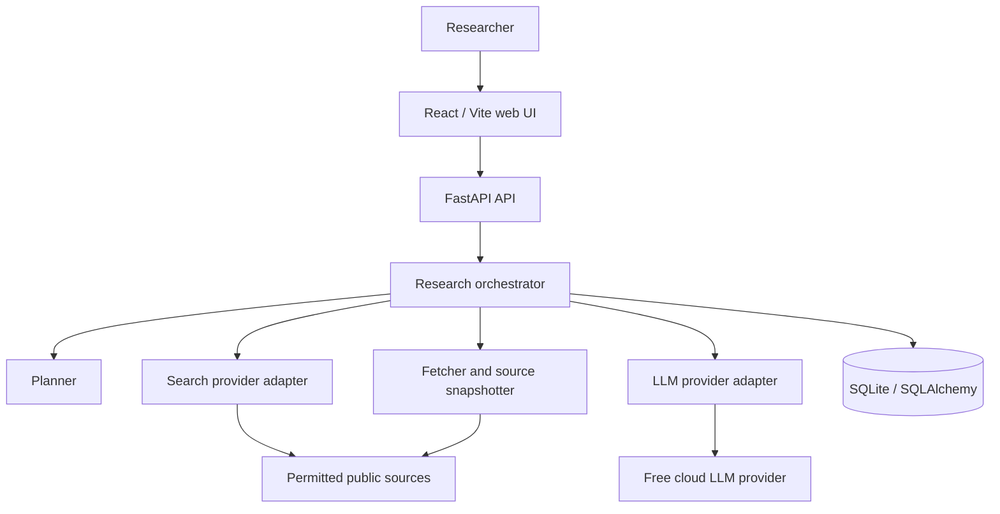

# 3. System Architecture

## Chosen architecture

The MVP is a modular monolith. It provides all mandatory assessment layers while keeping the number of moving parts appropriate for a one-day implementation.

## Component responsibilities

| Component | Responsibilities | Does not do |
| --- | --- | --- |
| React UI | Submit question, poll/display run state, show report and traceability. | Research logic or hidden source manipulation. |
| FastAPI | Validated APIs, orchestration entry points, error translation. | Long-term distributed scheduling. |
| Orchestrator | Executes stages, persists state/events, applies limits, retries safe steps. | Answering directly from the question. |
| Search/fetch adapters | Discover permitted sources, normalize URLs, fetch and snapshot content. | Inventing facts. |
| LLM adapter | Structured planning, extraction, comparison, synthesis. | Owning persistence or source authority. |
| Database | Persist projects, snapshots, claims, relationships, conclusions, audit metadata. | Semantic reasoning. |

## Important implementation decisions

- SQLite is the default local database because it is persistent and needs no service setup. The SQLAlchemy model must stay PostgreSQL-compatible.
- The research execution may initially run in-process, but every step is persisted so an interrupted run can be displayed and restarted.
- AI and search calls are hidden behind interfaces. The rest of the application must not import a provider SDK directly.
- Source content is treated as untrusted input and delimited before it reaches the LLM.

## Deferred provider decision

`LLMProvider` will be configured through environment variables. Groq is the first cloud provider to validate because it offers a current free plan and fast inference; a second adapter can be added only if testing exposes a concrete problem. A provider failure must leave the run in a clear failed/partial state rather than fabricate results.
