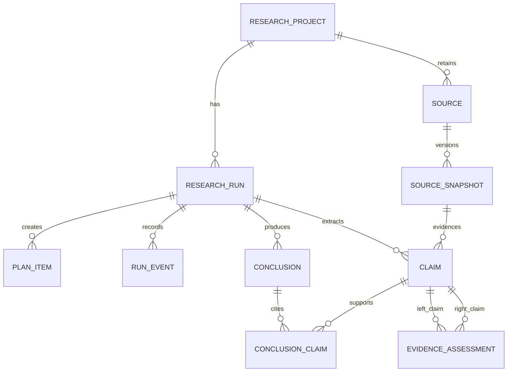

# 5. Data Model

## Core model

## Tables and essential fields

| Entity | Essential fields |
| --- | --- |
| `research_projects` | id, title, original_question, created_at |
| `research_runs` | id, project_id, status, provider_name, model_name, limits_json, started_at, completed_at, error_summary |
| `plan_items` | id, run_id, item_type (`sub_question`/`search_query`), text, position |
| `run_events` | id, run_id, stage, status, message, metadata_json, occurred_at |
| `sources` | id, canonical_url, title, publisher, author, published_at, source_type, first_retrieved_at |
| `source_snapshots` | id, source_id, run_id, retrieved_at, content_hash, cleaned_text, fetch_status, http_status |
| `claims` | id, run_id, snapshot_id, topic, statement, classification, confidence, exact_excerpt, excerpt_start, excerpt_end |
| `evidence_assessments` | id, left_claim_id, right_claim_id, relationship, rationale, conditions, confidence |
| `conclusions` | id, run_id, statement, confidence, limitations |
| `conclusion_claims` | conclusion_id, claim_id, role (`supports`/`qualifies`/`contradicts`) |

## Integrity rules

- A claim must reference exactly one source snapshot and a non-empty exact excerpt.
- A conclusion must have at least one `conclusion_claims` row before it can be exposed as complete.
- A source is deduplicated by normalized canonical URL; snapshots preserve the content seen on each retrieval.
- `relationship` values are an enum: `supports`, `qualifies`, `contradicts`, `unrelated`.
- Foreign keys and unique constraints are enabled in SQLite tests.

## Why this replaces a generic findings/evidence model

`Claim` is the smallest testable unit of extracted intelligence. A source excerpt supports a claim directly; an assessment relates two claims; a conclusion cites claims. This makes the traceability path unambiguous and easy to demonstrate.
