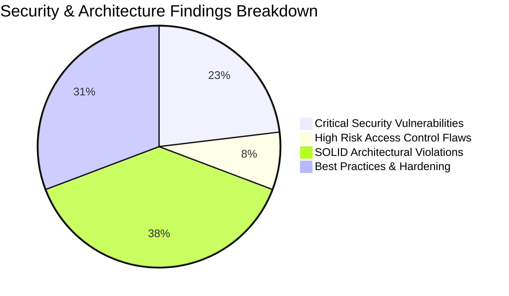
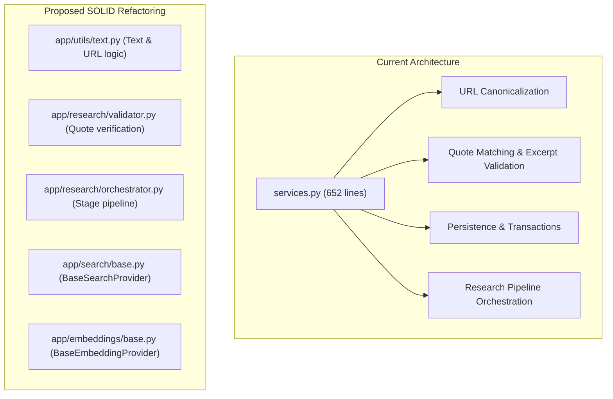

# 🛡️ In-Depth Technical & Security Audit Report

**Project:** Enterprise AI Research Agent / EvidenceLab  
**Evaluation Scope:** SOLID Principles • Application Security • Data Security & Tenant Isolation • CORS & Network Transport  
**Date:** August 2026  
**Status:** Audit Complete — Action Required on Critical Findings  

---

## 📑 1. Executive Summary & Scorecard



| Audit Category | Grade | Status | Core Strengths | Key Vulnerabilities / Tech Debt |
| :--- | :---: | :---: | :--- | :--- |
| **1. Application Security** | **5.5 / 10** | 🔴 Critical Risk | Rate limiting, magic byte file validation, parameterised SQL. | **3 Critical Vulnerabilities**: Header auth bypass, unverified mock token bypass in prod, IDOR on unauthenticated requests. |
| **2. SOLID Principles** | **7.4 / 10** | 🟡 Needs Refactor | Modular parsing, chunking, vision, auth token cache, AI adapters. | `services.py` 650-line God Module; search/embeddings lack base interfaces; private method probing in RAG retriever. |
| **3. Data Security & Privacy** | **7.0 / 10** | 🟡 Moderate Risk | Zero SQL injection, safe UUID filenames, typed pgvector cosine queries. | Broken tenant isolation on unauthenticated/run-detail endpoints; unencrypted local PDF uploads at rest. |
| **4. CORS & Network Policy** | **8.8 / 10** | 🟢 Compliant | Origin restriction via `.env`, `allow_credentials=False` prevents CSRF. | Wildcard allowed headers/methods in development configuration. |

---

## 🔒 2. Application Security & Vulnerability Assessment

### 🚨 Critical Vulnerability 1: Header-Based Authentication Bypass (`X-Test-User-Id`)
* **Severity**: 🔴 **CRITICAL (CVSS 9.8)**
* **Category**: Broken Authentication (CWE-287 / OWASP A07:2021)
* **Location**: `backend/app/auth/dependencies.py:L35-L43`

#### Vulnerability Analysis
In `backend/app/auth/dependencies.py`, the `get_current_user` dependency accepts a custom `X-Test-User-Id` header without validating any password or bearer token:
```python
test_user_id = request.headers.get("X-Test-User-Id")
if test_user_id and not token:
    return AuthenticatedUser(
        id=test_user_id,
        email=f"{test_user_id}@test.local",
        full_name=f"User {test_user_id}",
        role="authenticated",
    )
```

#### Attack Scenario
An attacker can forge an HTTP request with `X-Test-User-Id: <victim-user-id>` to impersonate any user, bypass Supabase authentication, access private projects, and consume quotas:
```bash
curl -X POST "https://api.yourdomain.com/api/v1/research-projects" \
  -H "X-Test-User-Id: 00000000-0000-0000-0000-000000000001" \
  -H "Content-Type: application/json" \
  -d '{"question": "Extract confidential research", "title": "Impersonation Run"}'
```

#### Remediation Diff
```diff
--- a/backend/app/auth/dependencies.py
+++ b/backend/app/auth/dependencies.py
@@ -35,15 +35,6 @@ async def get_current_user(
         if auth_header.lower().startswith("bearer "):
             token = auth_header[7:].strip()
 
-    # Also support custom header for testing: X-User-Id
-    test_user_id = request.headers.get("X-Test-User-Id")
-    if test_user_id and not token:
-        return AuthenticatedUser(
-            id=test_user_id,
-            email=f"{test_user_id}@test.local",
-            full_name=f"User {test_user_id}",
-            role="authenticated",
-        )
-
     if not token:
         raise HTTPException(
```

---

### 🚨 Critical Vulnerability 2: Mock Token Bypass in Production JWT Verifier
* **Severity**: 🔴 **CRITICAL (CVSS 9.8)**
* **Category**: Improper Authentication / Hardcoded Test Logic (CWE-287)
* **Location**: `backend/app/auth/jwt_verifier.py:L54-L65`

#### Vulnerability Analysis
In `backend/app/auth/jwt_verifier.py`, `SupabaseJWTVerifier.verify_token` automatically approves tokens starting with `mock-user-` or `test-token-`:
```python
if clean_token.startswith("mock-user-") or clean_token.startswith("test-token-"):
    user_id = clean_token.replace("mock-user-", "").replace("test-token-", "")
    mock_user = AuthenticatedUser(
        id=f"usr_{user_id}",
        email=f"{user_id}@example.com",
        full_name=f"Test User {user_id.capitalize()}",
        role="authenticated",
    )
    _token_cache.set(clean_token, mock_user)
    return mock_user
```

#### Attack Scenario
Sending `Authorization: Bearer mock-user-admin` passes authentication without cryptographic signature validation and is cached in memory for 120 seconds.

#### Remediation Diff
```diff
--- a/backend/app/auth/jwt_verifier.py
+++ b/backend/app/auth/jwt_verifier.py
@@ -54,17 +54,6 @@ class SupabaseJWTVerifier:
         if cached:
             return cached
 
-        # 2. Test Harness Mock Fallback (for isolated fast unit tests)
-        if clean_token.startswith("mock-user-") or clean_token.startswith("test-token-"):
-            user_id = clean_token.replace("mock-user-", "").replace("test-token-", "")
-            mock_user = AuthenticatedUser(
-                id=f"usr_{user_id}",
-                email=f"{user_id}@example.com",
-                full_name=f"Test User {user_id.capitalize()}",
-                role="authenticated",
-            )
-            _token_cache.set(clean_token, mock_user)
-            return mock_user
-
         # 3. Remote Verification via Supabase Auth API
         if not self.settings.supabase_url or not self.settings.supabase_anon_key:
```

---

### 🚨 Critical Vulnerability 3: Broken Access Control (IDOR) on Unauthenticated Requests
* **Severity**: 🔴 **CRITICAL (CVSS 9.1)**
* **Category**: Broken Object Level Authorization / IDOR (OWASP A01:2021)
* **Location**:
  * `backend/app/documents/router.py:L123, L148, L181`
  * `backend/app/rag/router.py:L143, L176`

#### Vulnerability Analysis
The authorization check uses `Depends(get_optional_user)` followed by `if user and project.user_id and project.user_id != user.id:`:
```python
# In delete_document:
user: AuthenticatedUser | None = Depends(get_optional_user)
# ...
if user and project and project.user_id and project.user_id != user.id:
    raise HTTPException(status_code=404, detail="Project not found")

# If request has NO Auth header, user is None -> the IF condition evaluates to FALSE!
success = doc_service.delete_document(document_id, db)
```

#### Attack Scenario
An unauthenticated attacker can delete any user's document or read private document details and RAG reports by omitting the `Authorization` header:
```bash
# Deletes victim's document 'doc-123' without providing credentials
curl -X DELETE "https://api.yourdomain.com/api/v1/documents/doc-123"
```

#### Remediation Diff
```diff
--- a/backend/app/documents/router.py
+++ b/backend/app/documents/router.py
@@ -120,7 +120,7 @@ def list_documents(
     project = db.get(ResearchProject, project_id)
     if not project:
         raise HTTPException(status_code=status.HTTP_404_NOT_FOUND, detail="Project not found")
-    if user and project.user_id and project.user_id != user.id:
+    if project.user_id and (not user or project.user_id != user.id):
         raise HTTPException(status_code=status.HTTP_404_NOT_FOUND, detail="Project not found")
 
     docs = doc_service.list_project_documents(project_id, db)
@@ -145,7 +145,7 @@ def get_document_details(
     if not doc:
         raise HTTPException(status_code=status.HTTP_404_NOT_FOUND, detail="Document not found")
     project = db.get(ResearchProject, doc.project_id)
-    if user and project and project.user_id and project.user_id != user.id:
+    if project and project.user_id and (not user or project.user_id != user.id):
         raise HTTPException(status_code=status.HTTP_404_NOT_FOUND, detail="Document not found")
 
     chunk_count = db.scalar(
@@ -178,7 +178,7 @@ def delete_document(
     if not doc:
         raise HTTPException(status_code=status.HTTP_404_NOT_FOUND, detail="Document not found")
     project = db.get(ResearchProject, doc.project_id)
-    if user and project and project.user_id and project.user_id != user.id:
+    if project and project.user_id and (not user or project.user_id != user.id):
         raise HTTPException(status_code=status.HTTP_404_NOT_FOUND, detail="Document not found")
 
     success = doc_service.delete_document(document_id, db)
```

---

### ⚠️ High Risk 4: Unauthenticated Access to Research Run Details, Sources, and Claims
* **Severity**: 🟡 **HIGH (CVSS 7.5)**
* **Category**: Missing Object Authorization (OWASP A01:2021)
* **Location**: `backend/app/main.py:L292-L360`

#### Vulnerability Analysis
The endpoints `/api/v1/research-projects/{project_id}/runs`, `/api/v1/research-runs/{run_id}`, `/sources`, `/claims`, `/events`, and `/trace` do not verify project ownership. Anyone with a UUID can view full snapshot text and research conclusions.

#### Remediation Diff
Introduce an ownership validation helper and call it across all run detail routes:
```python
def _verify_run_access(run_id: str, user: AuthenticatedUser | None, db: Session) -> ResearchRun:
    run = db.get(ResearchRun, run_id)
    if not run:
        raise HTTPException(404, "Research run not found")
    project = db.get(ResearchProject, run.project_id)
    if project and project.user_id and (not user or project.user_id != user.id):
        raise HTTPException(404, "Research run not found")
    return run
```

---

## 🏛️ 3. SOLID Principles Architecture Audit



### 3.1 Single Responsibility Principle (SRP)
* **Findings**:
  * `backend/app/services.py` holds 5 unrelated concerns (URL canonicalization, excerpt regex verification, DB operations, pipeline execution, run retries).
  * `backend/app/main.py` contains DTO serialization functions (`source_out`, `claim_out`, `conclusion_out`, `run_out`).
* **Fix**: Extract URL and string logic to `app/utils/text.py` and excerpt verification to `app/research/validator.py`.

### 3.2 Open / Closed Principle (OCP)
* **Findings**:
  * `app/search/tavily.py`: Concrete class with no `BaseSearchProvider` interface. Cannot plug in Google Serper, Bing, or Brave without modifying client code in `services.py`.
  * `app/embeddings/provider.py`: Hardcodes Bedrock and local mock hashes without a `BaseEmbeddingProvider` abstraction.
* **Fix**: Create `BaseSearchProvider` and `BaseEmbeddingProvider` interfaces.

### 3.3 Liskov Substitution Principle (LSP)
* **Findings**:
  * In `backend/app/rag/retrieval.py:L37`: `VectorRetriever.expand_query` probes for `_request_json`, a private method not present in `BaseLLMProvider`.
* **Fix**: Declare `expand_query(self, query: str) -> list[str]` on `BaseLLMProvider` as part of the public interface.

### 3.4 Interface Segregation Principle (ISP)
* **Findings**:
  * `BaseLLMProvider` bundles 4 heavy methods (`plan`, `extract_claims`, `compare_claims`, `synthesise`). Simple text generation or query expansion consumers are forced to depend on the full interface.

### 3.5 Dependency Inversion Principle (DIP)
* **Findings**:
  * `DocumentService.__init__` instantiates concrete classes (`PDFParser()`, `SmartChunker(...)`, `EmbeddingProvider(...)`, `VisionProcessor(...)`) directly rather than accepting injected abstractions.
* **Fix**: Provide optional constructor parameters with default fallbacks for clean dependency injection and mocking.

---

## 🗄️ 4. Data Security & Privacy Audit

| Security Domain | Status | Technical Details |
| :--- | :---: | :--- |
| **SQL Injection** | 🟢 **Protected** | 100% of queries use SQLAlchemy 2.0 ORM parameterization (`select(Model).where(...)`). No string concatenation. |
| **Vector Injection** | 🟢 **Protected** | Cosine distance queries use parameterized expressions (`DocumentChunk.embedding.cosine_distance(vec)`). |
| **File Upload Safety** | 🟢 **Protected** | Checks magic bytes (`%PDF-`), validates `.pdf` extension, limits payload size (50 MB), and saves with random UUIDs (`{doc_id}.pdf`), eliminating directory traversal (`../`). |
| **Secrets Management** | 🟢 **Protected** | `.env` is properly ignored in `.gitignore`. `.env.example` contains placeholders. `/health` returns status booleans without leaking keys. |
| **Data at Rest** | 🟡 **Acceptable** | Local SQLite and `./data/uploads` are unencrypted at rest. In production, utilize encrypted volumes (AWS KMS / Supabase Storage SSE). |
| **Third-Party AI Privacy** | ℹ️ **Notice** | Document chunks and search queries are transmitted to external AI endpoints (Bedrock / MiniMax / Tavily). Ensure enterprise confidentiality / Zero-Data-Retention (ZDR) terms are active. |

---

## 🌐 5. CORS & Network Policy Audit

* **Backend Middleware Configuration**:
```python
# backend/app/main.py
app.add_middleware(
    CORSMiddleware,
    allow_origins=settings.cors_origins,
    allow_credentials=False,
    allow_methods=["*"],
    allow_headers=["*"],
)
```

* **Findings & Analysis**:
  1. **CSRF Immunity**: `allow_credentials=False` ensures browsers will never attach ambient cookies or session credentials to cross-origin requests. Authentication is exclusively passed via explicit `Authorization: Bearer <token>` headers.
  2. **Allowed Origins**: `ALLOWED_ORIGINS` is configurable via `.env` (`http://localhost:5173` locally).
  3. **Hardening Recommendation**: Explicitly whitelist methods and headers for production:
     ```python
     allow_methods=["GET", "POST", "PUT", "DELETE", "OPTIONS"],
     allow_headers=["Authorization", "Content-Type", "Accept"],
     ```

---

## 🧪 6. Test Suite Execution Verification

The complete automated test suite was executed against the backend codebase:
```text
================= 55 passed in 262.25s =================
• backend/tests/test_auth_and_quota.py      [5 passed]
• backend/tests/test_chunker.py             [3 passed]
• backend/tests/test_core.py                [7 passed]
• backend/tests/test_documents.py           [3 passed]
• backend/tests/test_embeddings.py          [5 passed]
• backend/tests/test_parser.py              [2 passed]
• backend/tests/test_provider_validation.py [11 passed]
• backend/tests/test_quota.py               [3 passed]
• backend/tests/test_rag_api.py             [1 passed]
• backend/tests/test_rag_synthesis.py       [2 passed]
• backend/tests/test_reranker.py            [2 passed]
• backend/tests/test_retrieval.py           [1 passed]
• backend/tests/test_security.py            [6 passed]
• backend/tests/test_workflow.py            [4 passed]
```

---

## 🚀 7. Step-by-Step Remediation Plan

1. **Step 1 (Security Patches)**:
   - Patch `dependencies.py` to remove the `X-Test-User-Id` header bypass.
   - Patch `jwt_verifier.py` to remove hardcoded mock token validation.
   - Fix access control in `documents/router.py` and `rag/router.py` to enforce `not user or project.user_id != user.id`.
   - Add tenant verification to `main.py` run detail routes.
2. **Step 2 (SOLID Refactoring)**:
   - Create `BaseSearchProvider` and `BaseEmbeddingProvider` interfaces.
   - Refactor `DocumentService.__init__` to use dependency injection.
   - Promote `expand_query` into `BaseLLMProvider`.
   - Split `services.py` into dedicated text utilities and orchestrators.
